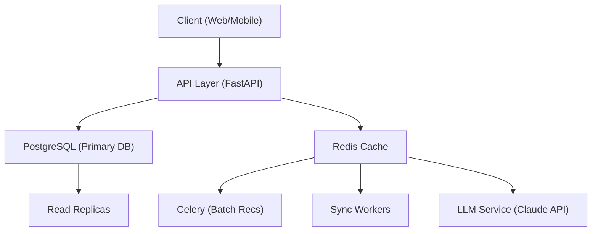

## Part 3 — System Design

### The Problem

Timing's core product is a networking assistant that tracks relationship history, syncs interactions, and reminds users when to follow up. Right now this assessment models a small piece of that, but at scale, Timing needs to support 1 million users with up to 1,000 contacts each. That's a billion contact records, and every morning each user needs a fresh set of personalized recommendations on who to reach out to.

This isn't just a CRUD app at that point. It's a daily batch compute problem, a real-time sync problem, and a personalization problem all at once.

### Architecture


<details>
<summary>View text-based diagram</summary>
┌──────────────────┐     ┌───────────────┐     ┌──────────────────┐
│  Client          │────▶│  API Layer    │────▶│  PostgreSQL      │
│  (Web/Mobile)    │     │  (FastAPI)    │     │  (Primary DB)    │
└──────────────────┘     └──────┬────────┘     └──────────────────┘
│                        │
┌──────▼────────┐     ┌────────▼─────────┐
│  Redis Cache  │     │  Read Replicas   │
└───────────────┘     └──────────────────┘
│
┌─────────────┼─────────────┐
▼             ▼              ▼
┌──────────────┐ ┌──────────┐ ┌──────────────────┐
│ Celery       │ │ Sync     │ │ LLM Service      │
│ (Batch Recs) │ │ Workers  │ │ (Claude API)     │
└──────────────┘ └──────────┘ └──────────────────┘

</details>

The flow: users interact through the client, which hits the API layer. The API reads from Redis for fast cached results or falls back to Postgres. Behind the scenes, three worker types handle the heavy lifting — batch recommendation generation, real-time interaction syncing, and LLM calls. These are separated because they scale differently. Batch is predictable and scheduled. Sync is bursty. LLM calls are sporadic and expensive.


- **Batch workers** — generate nightly recommendations for every user
- **Sync workers** — process real-time interaction events (Timing detects you emailed someone, a calendar meeting ended, etc.) and update contact records immediately
- **LLM workers** — handle on-demand message generation when a user clicks "write a message" in Timing's chatbot

These are separated because they have completely different scaling profiles. Batch is predictable and scheduled. Sync is bursty and mostly event-driven. LLM calls are more scattered and expensive.

### Data Storage — Modeling Timing's Relationship Graph

I'd use PostgreSQL here. Timing's data is naturally relational since users have contacts, contacts have interactions, and everything is connected.

The way I'd structure it is four main tables:

- **users** — each person using Timing, plus a JSON field for their preferences like communication style and reminder frequency
- **contacts** — every contact a user has, linked back by user_id. Name, email, company, last contacted date, notes
- **interactions** — this is the big one. Every email, call, or meeting with a contact gets logged here with a timestamp and a source field so we know if it came from Gmail, a calendar event, or was entered manually. This is what makes Timing more than a contact list — it's the full relationship history
- **recommendations** — instead of running heavy queries every time someone opens the app, we pre-calculate recommendations overnight and store them here. When a user opens Timing, the results are already waiting

Here's a simplified look:
```sql
CREATE TABLE contacts (
    id                  BIGSERIAL PRIMARY KEY,
    user_id             BIGINT REFERENCES users(id),
    name                VARCHAR(255),
    email               VARCHAR(255),
    company             VARCHAR(255),
    last_contacted_date DATE,
    notes               TEXT
);

CREATE TABLE interactions (
    id          BIGSERIAL PRIMARY KEY,
    user_id     BIGINT REFERENCES users(id),
    contact_id  BIGINT REFERENCES contacts(id),
    type        VARCHAR(50),       -- 'email', 'call', 'meeting'
    occurred_at TIMESTAMP,
    source      VARCHAR(50)        -- 'gmail', 'calendar', 'manual'
);
```

The most important index is on `(user_id, last_contacted_date)` — this makes Timing's core query ("which of my contacts haven't I talked to recently?") fast instead of scanning every row in the table.

At a billion contacts, even indexes aren't enough on their own. I'd partition the contacts and interactions tables by user_id ranges. basically splitting them into smaller chunks so each query only touches the data it needs. So the data can be organized into sections instead of throwing everything into one giant pile.

### Compute Strategy

Generating recommendations for a million users can't happen on-demand, that would be too much for the database. Instead we could:

**Nightly batch processing:**
- Cron job kicks off at 2 AM EST
- Use Celery to distribute work across workers, each handling ~10,000 users
- For each user, the worker queries their contacts and recent interactions, applies priority scoring, and writes the top recommendations to the `recommendations` table
- Redis caches the results so when a user opens Timing in the morning, recommendations load instantly

With proper indexing, each user's recommendation query takes about 5ms. A million users across 100 workers finishes in only roughly 10 minutes.

**Real-time updates:**
The batch covers the baseline, but Timing also syncs interactions in real-time. If you email someone at 2 PM, the system should update that contact's `last_contacted_date` immediately. I'd use an event-driven approach here so when a new interaction is logged, push an event to a worker that recomputes just that user's recommendations. This way you get the efficiency of batch processing with the responsiveness of real-time.

### Hyper Personalization

This is where Timing's product really differentiates from a basic CRM, and it happens at two levels.

**Level 1 — Smart recommendations:**
The rule-based scoring from this assessment (investor > mentor > advisor, weighted by recency) is the foundation. Since Timing already does online research on contacts and tracks interaction patterns. At scale, I'd layer in:
- Modeling the interaction frequency — if you normally email Sarah weekly but it's been 3 weeks, that's a stronger signal than a generic "30 days" threshold
- Relationship by relationship factor — an investor you pitched last month is more time-sensitive than a college friend you haven't talked to in 6 months
- User feedback loops — track which recommendations users act on vs dismiss, and adjust scoring weights per user

**Level 2 — LLM-powered outreach:**
When a user clicks "generate message" in Timing's chatbot, we call Claude's API with:
- The contact's profile (name, company, role, relationship notes)
- Recent interaction history from the `interactions` table
- The user's communication style (learned from past messages they've sent or edited)

I'd store user preferences and communication patterns in the `users.preferences` JSONB column. Over time, track which generated messages get sent vs edited vs discarded and we could use that feedback loop trains the system to match each user's voice.

For cost control: use Haiku for simple check-in messages, Sonnet for more nuanced things. Cache common templates. LLM calls are on-demand only, so we can save more money that way

### Scaling

| Component        | Strategy                                                |
|------------------|---------------------------------------------------------|
| API Layer        | Auto-scaling containers behind a load balancer          |
| PostgreSQL       | Read replicas for queries, table partitioning by user   |
| Redis            | Clustered mode for distributed caching                  |
| Batch Workers    | Scale Celery worker count based on queue depth          |
| Sync Workers     | Scale independently based on interaction event volume   |
| LLM Service      | Rate limiting + request queuing per user                |

The biggest scaling risk is the interaction sync pipeline. As Timing grows, the volume of real-time events (emails sent, meetings logged) grows faster than user count since each user generates multiple events per day. I'd use a message queue like RabbitMQ or SQS to buffer events and decouple ingestion from processing.

If we outgrow single-instance Postgres, shard by `user_id` across multiple database instances. Monitoring with Datadog or Prometheus to track batch job health, API latency, cache hit rates, and interaction sync lag and if that number creeps up, users are seeing stale data, which directly undermines Timing's core promise of real-time relationship tracking.